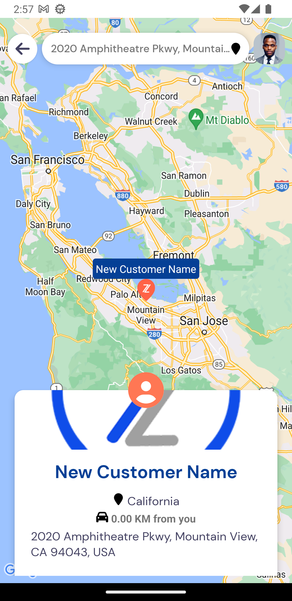

# ZuseTracker

## by Beni Kalonga - Second Technical Assignment

#Get started with this

- To run the project, Clone the app [ZuseTracker](https://github.com/benikalonga/ZuseTracker.git) 👍
- Open the CMD, and change the directory to the root (e.g CD ''../../ZuseTracker'')
- Run the command npm to install all the dependancies
- Run npm start to start the server
- Run npx react-native run-android to run on a android device or npx react-native run-ios to run on a iOS device

### Here is a video showing how it works

https://github.com/benikalonga/ZuseShop/assets/29547138/5a0660af-903c-44af-8a36-05ccd53ba0fa

# Features

- HomeScreen
- MapScreen
- DetailScreen
- CreationCustomerScreen
- LoginScreen
- ProfilScreen
- AboutScreen
- SplashScreen

# Depencies and Libraries

[In the Package.json file](package.json)

- "@fortawesome/fontawesome-svg-core": "^6.4.0",
- "@fortawesome/free-brands-svg-icons": "^6.4.0",
- "@fortawesome/free-regular-svg-icons": "^6.4.0",
- "@fortawesome/free-solid-svg-icons": "^6.4.0",
- "@fortawesome/react-native-fontawesome": "^0.3.0",
- "@react-native-async-storage/async-storage": "^1.18.2",
- "@react-native-community/geolocation": "^3.0.6",
- "@react-navigation/native": "^6.1.7",
- "@react-navigation/native-stack": "^6.9.13",
- "@react-navigation/stack": "^6.3.17",
- "@reduxjs/toolkit": "^1.9.5",
- "axios": "^1.4.0",
- "haversine": "^1.1.1",
- "react": "18.2.0",
- "react-native": "0.72.1",
- "react-native-animatable": "^1.3.3",
- "react-native-blurhash": "^1.1.10",
- "react-native-gesture-handler": "^2.12.0",
- "react-native-maps": "^1.7.1",
- "react-native-pager-view": "^6.2.0",
- "react-native-paper": "^5.9.0",
- "react-native-reanimated": "^3.3.0",
- "react-native-safe-area-context": "^4.6.3",
- "react-native-screens": "^3.22.0",
- "react-native-share": "^9.1.0",
- "react-native-shared-element": "^0.8.8",
  "react-native-vector-icons": "^9.2.0",
  "react-navigation-shared-element": "^3.1.3",
  "react-redux": "^8.1.1",

# API (Free)

## [Mocki APi](https://api.mocki.io/v2/04517d70/) is the free API I used for the entire project

- Get all customers, [/getCustomers](https://api.mocki.io/v2/04517d70/getCustomers), GET Methon
- Get one customer by id, [/getCustomerById](https://api.mocki.io/v2/04517d70/getCustomer/id), GET Method
- Add a customer, [/addCustomer](https://api.mocki.io/v2/04517d70/addCustomer), POST Method

# Architecture (VVM of MVVM)

## Screenshots (Step by step)

 

  
  
  
  
  
  
  
  
  
  
  
  
  
  
 

